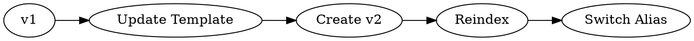
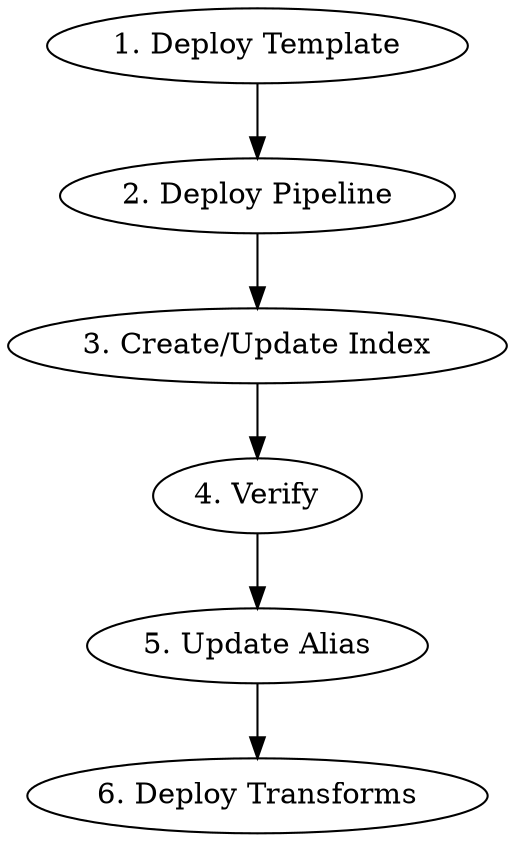
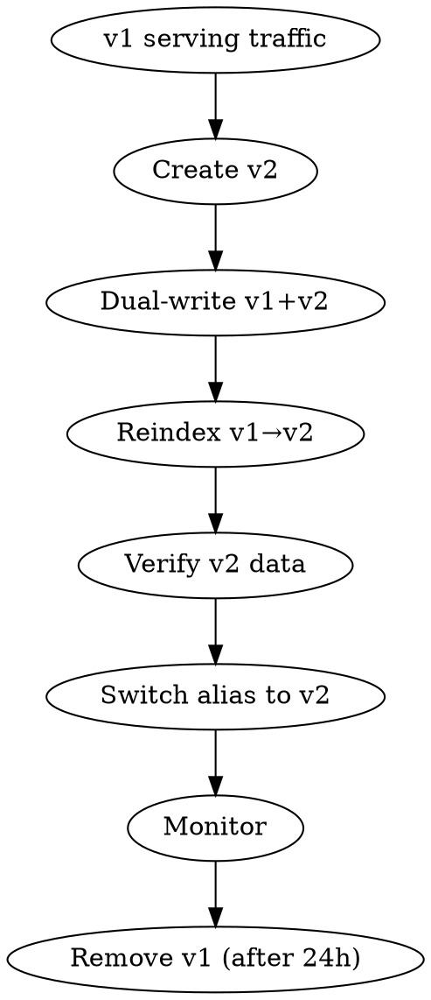

# Elasticsearch Master Guide

## Overview

Best practices and guidelines for working with Elasticsearch. Core principles:
1. **Template-First**: All indices created from templates
2. **Version Everything**: Index names include version numbers (`_v1`, `_v2`)
3. **Alias Always**: Production access through aliases only
4. **Strict Schema**: Use `dynamic: strict` to prevent schema drift

## Golden Rules

| Rule | Why |
|------|-----|
| Never create index directly | Use template → consistent settings |
| Never modify mapping in-place | ES rejects; create new version |
| Never use versioned name in code | Breaks on upgrade; use alias |
| Never alias testing indices | Prevents production confusion |
| Always specify `inference_id` | Semantic search fails without it |
| Always set shard count | Cannot change after index creation |

## Critical Settings

### Shard and Replica Strategy

```json
{
  "settings": {
    "index": {
      "number_of_shards": "1",      // CANNOT change after creation
      "number_of_replicas": "1"     // CAN change anytime
    }
  }
}
```

**Shard sizing guidelines:**

| Index Size | Shards | Rationale |
|------------|--------|-----------|
| < 50 GB | 1 | Avoid over-sharding |
| 50-200 GB | 3-5 | Balance parallelism |
| > 200 GB | Consider multiple indices | Or increase shards |

**Shard size sweet spot:** 10-50 GB per shard

**Replica strategy:**
- Production: `1-2` replicas (high availability)
- Bulk indexing: `0` replicas (speed), then increase
- Testing: `0` replicas (save resources)

### Component Templates

Reusable mapping and settings blocks:

```json
PUT /_component_template/common-settings
{
  "template": {
    "settings": {
      "number_of_shards": 1,
      "number_of_replicas": 1,
      "refresh_interval": "30s"
    }
  }
}

PUT /_component_template/common-analyzers
{
  "template": {
    "settings": {
      "analysis": {
        "analyzer": {
          "icu_analyzer": {
            "type": "custom",
            "tokenizer": "icu_tokenizer"
          }
        }
      }
    }
  }
}
```

**Use in index template:**
```json
{
  "index_patterns": ["my-index_v*"],
  "composed_of": ["common-settings", "common-analyzers"],
  "template": {
    "mappings": { ... }
  }
}
```

**Benefits:**
- DRY principle for settings
- Consistent analyzers across indices
- Easy to update multiple indices

## Index Naming

```
Production:  {prefix}-{suffix}_v{N}     → alias: {prefix}-{suffix}
Testing:     {prefix}-{suffix}_testing  → NO alias
Staging:     {prefix}-{suffix}_staging  → NO alias
Transform:   tf-{base-name}             → derived index
```

**Examples:**
```
video-tvbs_v2         → alias: video-tvbs
rss-news-tw_v3        → alias: rss-news-tw
video-tvbs_testing    → (direct access)
tf-rss-news-category  → (transform output)
```

## Workflow: New Index


### 1. Create Index Template

```json
{
  "index_patterns": ["my-index_v*"],
  "template": {
    "settings": {
      "index": {
        "default_pipeline": "my-pipeline"
      }
    },
    "mappings": {
      "dynamic": "strict",
      "properties": { }
    }
  },
  "priority": 20,
  "_meta": {
    "modifier": "name",
    "lastUpdateTime": "2025-01-20"
  }
}
```

### 2. Create Index (auto-applies template)

```bash
PUT /my-index_v1
```

### 3. Create Alias

```json
{"actions": [{"add": {"index": "my-index_v1", "alias": "my-index"}}]}
```

## Workflow: Modify Mapping

**Cannot modify in-place.** Must version upgrade:



**Atomic alias switch:**
```json
{
  "actions": [
    {"remove": {"index": "my-index_v1", "alias": "my-index"}},
    {"add": {"index": "my-index_v2", "alias": "my-index"}}
  ]
}
```

## Semantic Search

### Field Configuration

```json
{
  "title": {
    "type": "text",
    "analyzer": "icu_analyzer",
    "fields": {
      "semantic": {
        "type": "semantic_text",
        "inference_id": "your-embedding-model",
        "model_settings": {
          "task_type": "text_embedding",
          "dimensions": 1536,
          "similarity": "dot_product"
        }
      }
    }
  }
}
```

**Required:** `inference_id` must point to deployed embedding model.

### Query

```json
{"query": {"semantic": {"field": "title.semantic", "query": "search text"}}}
```

## Ingest Pipeline

### Standard Pattern

```json
{
  "processors": [
    {"fingerprint": {"fields": ["url"]}},
    {"set": {"field": "_id", "copy_from": "fingerprint"}},
    {"date": {"field": "pubdate", "target_field": "date"}},
    {"html_strip": {"field": "content"}},
    {"script": {"source": "validation logic"}},
    {"inference": {"model_id": "embedding-model"}}
  ],
  "on_failure": [
    {"set": {"field": "_index", "value": "failed-{name}"}}
  ]
}
```

**Processor order matters:** fingerprint → set _id → validate → transform

## Search Template (Mustache)

### Conditional & Defaults

```mustache
{
  "size": {{size}}{{^size}}10{{/size}},
  {{#use_filter}}
  "query": {"bool": {"filter": [{"range": {"date": {"gte": "{{start}}"}}}]}}
  {{/use_filter}}
}
```

### Combined Scoring

```json
{
  "function_score": {
    "query": {"match": {"title": "{{topic}}"}},
    "functions": [
      {"gauss": {"publish_time": {"origin": "now", "scale": "7d"}}},
      {"field_value_factor": {"field": "view_count", "modifier": "log1p"}}
    ]
  }
}
```

## Transform

```json
{
  "source": {"index": ["source-index"]},
  "dest": {"index": "tf-aggregated"},
  "frequency": "30m",
  "sync": {"time": {"field": "date", "delay": "60s"}},
  "pivot": {
    "group_by": {"category": {"terms": {"field": "category"}}},
    "aggregations": {"count": {"value_count": {"field": "date"}}}
  }
}
```

## Directory Structure

```
project/
├── templates/
│   ├── index-templates/     # Primary source of truth
│   └── component-templates/ # Shared mappings
├── aliases/                 # Alias configurations
├── pipelines/               # Ingest pipelines
├── search-templates/        # Query templates
├── transforms/              # Transform configs
├── indices/                 # Index settings (reference)
└── mappings/                # Mapping definitions (reference)
```

## Deployment Rules

### Non-Breaking Updates

**Can update existing index directly (no reindex):**

| Change | Method | Risk |
|--------|--------|------|
| Add new field | `PUT /index/_mapping` | Low - existing docs unaffected |
| Update `number_of_replicas` | `PUT /index/_settings` | None - dynamic setting |
| Update `refresh_interval` | `PUT /index/_settings` | None - dynamic setting |
| Add index alias | `POST /_aliases` | None - additive only |
| Update `ignore_above` | `PUT /index/_mapping` | Low - only affects new docs |

**Requires reindex (breaking changes):**

| Change | Why |
|--------|-----|
| Change field type | Existing data incompatible |
| Change analyzer | Affects indexed tokens |
| Remove field | Cannot remove from mapping |
| Change `number_of_shards` | Fixed at creation |

**Adding field to existing index:**
```json
PUT /my-index/_mapping
{
  "properties": {
    "new_field": {
      "type": "keyword"
    }
  }
}
```

### Deployment Workflow



**Step-by-step:**

#### 1. Deploy Index Template First
```bash
PUT /_index_template/my-template
{
  "index_patterns": ["my-index_v*"],
  "template": { ... },
  "priority": 20
}
```

**Why first:** Templates don't affect existing indices; safe to deploy anytime.

#### 2. Deploy Ingest Pipeline
```bash
PUT /_ingest/pipeline/my-pipeline
{ "processors": [...] }
```

**Verify with simulate:**
```bash
POST /_ingest/pipeline/my-pipeline/_simulate
{
  "docs": [{"_source": {"field": "test value"}}]
}
```

#### 3. Create or Update Index

**New index (uses template automatically):**
```bash
PUT /my-index_v2
```

**Update existing index (non-breaking only):**
```bash
# Sync template changes to existing index
PUT /my-index_v2/_mapping
{
  "properties": {
    "new_field": {"type": "keyword"}
  }
}
```

**Critical:** Ensure template is already updated before index update.

#### 4. Verify Index Configuration
```bash
GET /my-index_v2/_mapping
GET /my-index_v2/_settings
```

#### 5. Update Alias (if new version)
```bash
POST /_aliases
{
  "actions": [
    {"remove": {"index": "my-index_v1", "alias": "my-index"}},
    {"add": {"index": "my-index_v2", "alias": "my-index"}}
  ]
}
```

#### 6. Deploy Transforms (after data exists)
```bash
PUT /_transform/my-transform
{ ... }

POST /_transform/my-transform/_start
```

### Deployment Order Priority

| Resource | Order | Reason |
|----------|-------|--------|
| Index Templates | 1st | Doesn't affect running system |
| Component Templates | 1st | Used by index templates |
| Ingest Pipelines | 2nd | Needed before data flows |
| Indices (new) | 3rd | Uses templates |
| Index Updates | 3rd | Non-breaking additions |
| Aliases | 4th | Controls traffic routing |
| Search Templates | 5th | Query-only, no data risk |
| Transforms | 6th | Requires source data |

### Zero-Downtime Deployment

For breaking changes requiring reindex:



**Implementation:**
```bash
# 1. Create v2 with new mapping
PUT /my-index_v2

# 2. Application starts dual-writing to both v1 and v2

# 3. Reindex historical data
POST /_reindex?wait_for_completion=false
{
  "source": {"index": "my-index_v1"},
  "dest": {"index": "my-index_v2"}
}

# 4. Monitor reindex progress
GET /_tasks/<task_id>

# 5. Verify data completeness
GET /my-index_v2/_count

# 6. Switch alias (atomic)
POST /_aliases
{
  "actions": [
    {"remove": {"index": "my-index_v1", "alias": "my-index"}},
    {"add": {"index": "my-index_v2", "alias": "my-index"}}
  ]
}

# 7. Stop dual-write, monitor for 24h, then delete v1
```

### Rollback Strategy

**If deployment fails:**

| Scenario | Rollback Action |
|----------|-----------------|
| Template issue | Revert template PUT (immediate) |
| Pipeline broken | Fix pipeline or disable with `PUT /_cluster/settings` |
| New index bad | Switch alias back to old version |
| Mapping update failed | Usually can't rollback; add compensating field |

**Quick alias rollback:**
```bash
POST /_aliases
{
  "actions": [
    {"remove": {"index": "my-index_v2", "alias": "my-index"}},
    {"add": {"index": "my-index_v1", "alias": "my-index"}}
  ]
}
```

### Safety Checks

**Before any deployment:**
- [ ] Test in staging environment first
- [ ] Backup critical data (snapshot)
- [ ] Verify template with test index creation
- [ ] Simulate pipeline with sample documents
- [ ] Check cluster health: `GET /_cluster/health`
- [ ] Verify sufficient disk space
- [ ] Have rollback plan documented

**After deployment:**
- [ ] Verify index created with correct settings
- [ ] Check document ingestion works
- [ ] Monitor error logs for 15 minutes
- [ ] Validate search queries return expected results
- [ ] Check cluster performance metrics

**Monitoring commands:**
```bash
# Cluster health
GET /_cluster/health

# Index stats
GET /my-index/_stats

# Failed documents (if using on_failure routing)
GET /failed-my-index/_count

# Active tasks
GET /_tasks?detailed=true&actions=*reindex
```

## Pre-Deploy Checklist

- [ ] Template updated with changes
- [ ] Index name follows `_vN` convention
- [ ] `dynamic: strict` enabled
- [ ] `default_pipeline` set (if using ingest)
- [ ] Semantic fields have `inference_id`
- [ ] Alias configured (production only)
- [ ] Pipeline has `on_failure` handler
- [ ] `_meta` has modifier and timestamp
